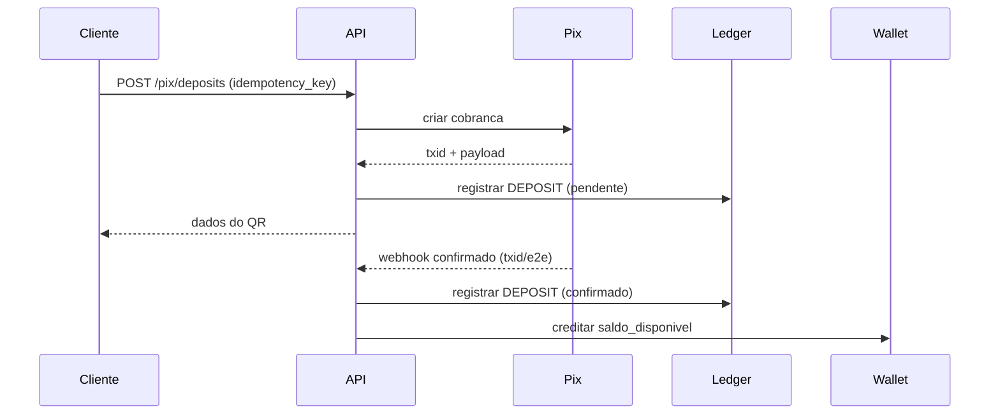
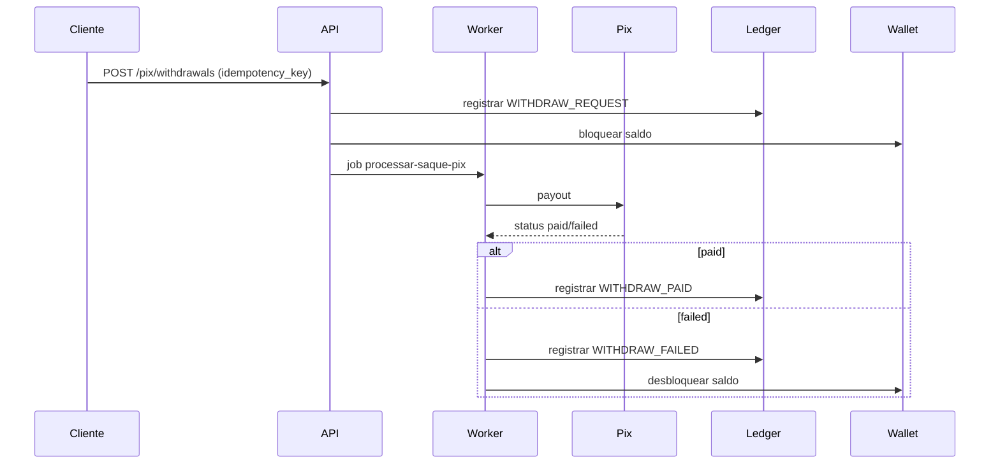
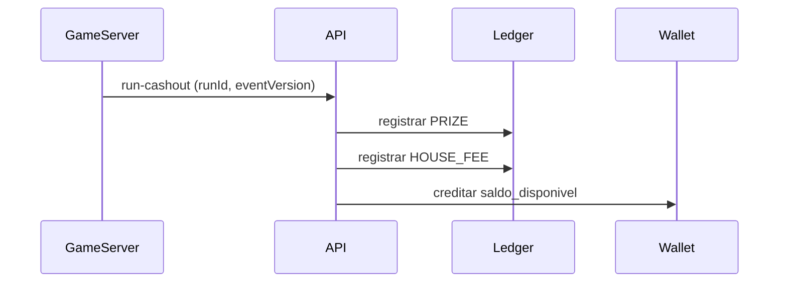

# Fluxo financeiro

This document describes the core money flows using Mermaid diagrams.

## Deposito Pix

```mermaid
sequenceDiagram
  participant Cliente
  participant API
  participant Pix
  participant Ledger
  participant Wallet

  Cliente->>API: POST /pix/deposits (idempotency_key)
  API->>Pix: criar cobranca
  Pix-->>API: txid + payload
  API->>Ledger: registrar DEPOSIT (pendente)
  API-->>Cliente: dados do QR
  Pix-->>API: webhook confirmado (txid/e2e)
  API->>Ledger: registrar DEPOSIT (confirmado)
  API->>Wallet: creditar saldo_disponivel
```

## Saque Pix

```mermaid
sequenceDiagram
  participant Cliente
  participant API
  participant Worker
  participant Pix
  participant Ledger
  participant Wallet

  Cliente->>API: POST /pix/withdrawals (idempotency_key)
  API->>Ledger: registrar WITHDRAW_REQUEST
  API->>Wallet: bloquear saldo
  API->>Worker: job processar-saque-pix
  Worker->>Pix: payout
  Pix-->>Worker: status paid/failed
  alt paid
    Worker->>Ledger: registrar WITHDRAW_PAID
  else failed
    Worker->>Ledger: registrar WITHDRAW_FAILED
    Worker->>Wallet: desbloquear saldo
  end
```

## Cash-out

```mermaid
sequenceDiagram
  participant GameServer
  participant API
  participant Ledger
  participant Wallet

  GameServer->>API: run-cashout (runId, eventVersion)
  API->>Ledger: registrar PRIZE
  API->>Ledger: registrar HOUSE_FEE
  API->>Wallet: creditar saldo_disponivel
```
