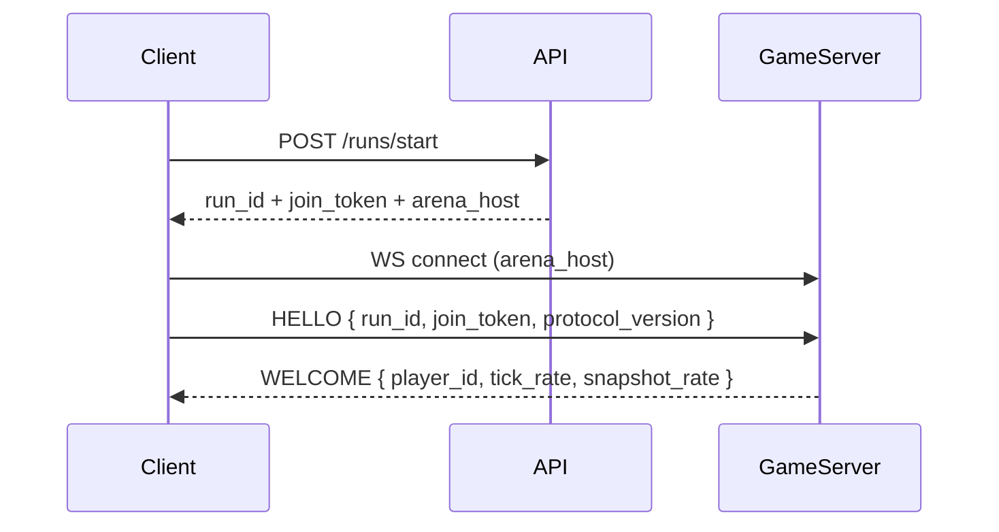
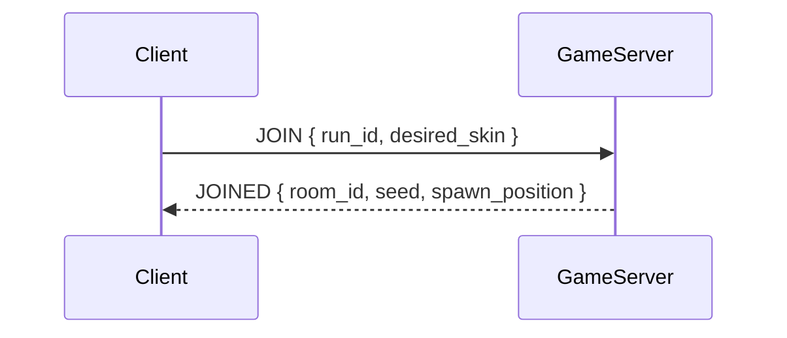
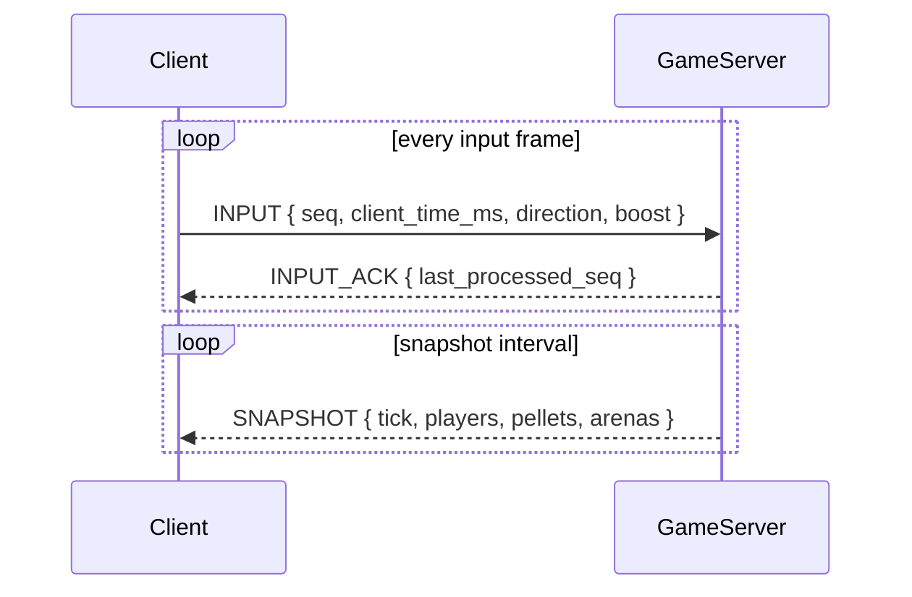
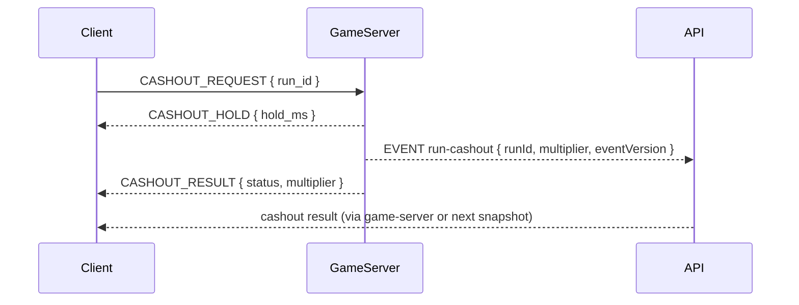
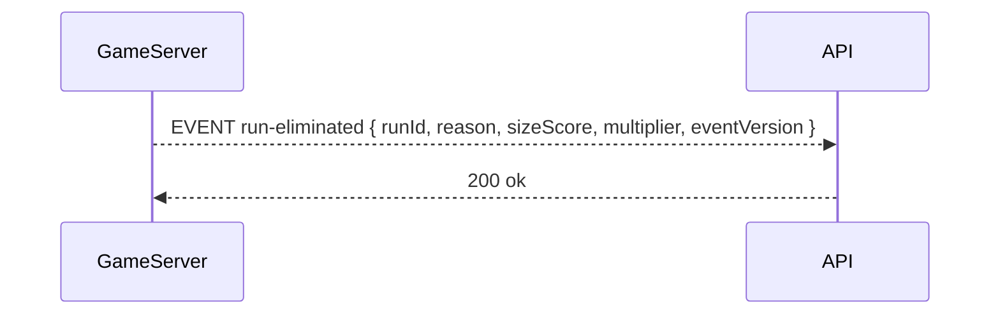

# Realtime protocol

This document describes the realtime flow between client and game-server.

## Handshake

## Join arena

## Game loop

## Cash-out request

## Elimination event

## Message contract notes

- `protocol_version` is required in HELLO; incompatible versions should be rejected.
- Inputs must be rate-limited and validated server-side.
- Client receives snapshots and interpolates; server is authoritative for collisions.
- Snapshots include `size_score` and `multiplier` for HUD rendering.
