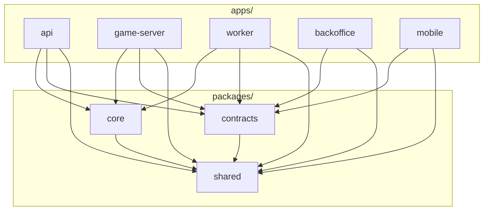

Fechado. Pelo teu escopo, isso aqui **não é “um backend e pronto”** — é um ecossistema: **App Mobile ↔ Game Server realtime**, com **Backend API** segurando **Pix + Wallet/Ledger**, mais **Jobs** (saque, expiração, conciliação) e um **Backoffice** mínimo pra não virar caos no dia 1.

E como a tua regra econômica é **house-banked** (cash-out = aposta × multiplicador do tamanho) com **taxa só no cash-out** e **sem salas por stake** (o usuário escolhe o valor e pronto), a entidade central vira mesmo a **RUN** + ledger bem amarrado.

A estrutura que te dá mais velocidade sem virar Frankenstein é: **MONOREPO** com `apps/` (o que é deployável) e `packages/` (o que é reutilizável e “puro”). Isso evita duplicação e mantém o core do dinheiro/jogo consistente.

---

## Estrutura do repositório (monorepo)

**Regra de ouro de dependência** (pra não nascer cobra mordendo o próprio rabo):

1. `packages/` **nunca** dependem de `apps/`
2. `apps/` podem depender de `packages/`
3. `apps/` **nunca** dependem de outros `apps/`


```text
/
├── apps/
│   ├── api/                      # Backend API (conta, wallet/ledger, pix, regras)
│   ├── game-server/              # Realtime authoritative (arena + run state + anti-cheat básico)
│   ├── worker/                   # Jobs/filas (saque pix, expiração, conciliação, etc.)
│   ├── backoffice/               # Admin web (mínimo operacional)
│   └── mobile/                   # Cliente mobile (placeholder — pode ser projeto separado)
│
├── packages/
│   ├── core/                     # Regras de negócio puras (entidades + casos de uso)
│   ├── contracts/                # DTOs + contratos HTTP/WebSocket/eventos entre apps
│   └── shared/                   # Utilitários realmente genéricos (SEM regra de negócio)
│
├── docs/
│   ├── arquitetura/              # teus docs Macro/Micro + diagramas
│   └── adr/                      # decisões (Architecture Decision Records)
│
├── infra/                        # infra local / deploy (db, filas, etc.) — sem acoplar código aqui
└── README.md
```

> Isso espelha exatamente teu mapa: cliente ↔ game server, cliente → API, API ↔ Pix, e jobs rodando “por fora”.

---

## Diagrama de dependências (pra ficar cristalino)



Isso segue o modelo do banco de exemplos: **core** fica “puro”, e cada app injeta infra/implementações. 

---

## Módulos de domínio (o “mapa” que vira pasta)

Baseado nas entidades/fluxos do teu V1, os módulos que viram pastas são:

* `usuarios` (nome/cpf/pix key, status)
* `sessoes` (login/autenticação)
* `carteiras` (saldo_disponivel / saldo_em_jogo / saldo_bloqueado)
* `movimentos-ledger` (extrato auditável; “de onde veio cada centavo”)
* `transacoes-pix` (depósito/saque via PSP + idempotência webhook)
* `arenas` (ArenaServidor por região/health)
* `runs` (vida do worm: preparar → em_jogo → cashout_armando → concluído/eliminado/abortado)
* `configuracoes` (min/max aposta, % taxa, tabela de multiplicador por tamanho)
* `contas-casa` (tesouraria/house + solvência/alertas)

---

## Padrão interno de cada app (organização dentro do `src/`)

Eu vou seguir os **5 princípios** da base (profundidade máxima, camadas, convenções, rotas e shared limpo).

### apps/api

```text
apps/api/
├── src/
│   ├── modules/
│   │   ├── usuarios/
│   │   ├── sessoes/
│   │   ├── carteiras/
│   │   ├── movimentos-ledger/
│   │   ├── transacoes-pix/
│   │   ├── runs/
│   │   ├── arenas/
│   │   ├── configuracoes/
│   │   └── contas-casa/
│   │
│   ├── shared/
│   │   ├── http/                 # server + middlewares + auth guard + validators
│   │   ├── database/             # conexão, migrations, transaction manager
│   │   ├── queue/                # publisher/consumer (se tiver)
│   │   ├── observability/        # logs, métricas, tracing
│   │   ├── errors/               # erros comuns (sem regra de negócio)
│   │   └── index.ts
│   │
│   └── main.ts
└── README.md
```

Essa forma é alinhada ao template de módulo backend (controllers/services/repository/entities/dtos/etc).

### apps/game-server

```text
apps/game-server/
├── src/
│   ├── modules/
│   │   ├── arenas/               # matchmaking/instância/rooms/region
│   │   ├── runs/                 # estado da run + cashout hold + validações realtime
│   │   └── anti-cheat/           # heurísticas básicas server-authoritative
│   │
│   ├── shared/
│   │   ├── realtime/             # ws/udp/tick loop, serialization
│   │   ├── observability/
│   │   └── index.ts
│   └── main.ts
└── README.md
```

O game server é quem controla `tamanho_score` e o `multiplicador_atual` vindo da tabela (configurável).

### apps/worker

```text
apps/worker/
├── src/
│   ├── jobs/
│   │   ├── confirmar-deposito-pix.job.ts
│   │   ├── expirar-cobranca-pix.job.ts
│   │   ├── processar-saque-pix.job.ts
│   │   ├── conciliacao-ledger.job.ts
│   │   └── anti-cheat.job.ts
│   ├── shared/
│   └── main.ts
└── README.md
```

Esses jobs vêm direto do escopo: confirmar depósito (webhook/polling), expirar cobrança, processar saque (fila), conciliar ledger vs PSP, e anti-cheat contínuo.

### apps/backoffice

```text
apps/backoffice/
├── src/
│   ├── modules/
│   │   ├── dashboard/
│   │   ├── usuarios/
│   │   ├── transacoes-pix/
│   │   ├── ledger/
│   │   ├── runs/
│   │   └── configuracoes/
│   └── shared/
└── README.md
```

Backoffice mínimo do V1: ver usuários/status, ver pix e ledger, ver runs, configurar taxa/min-max/tabela de multiplicador, e ajuste manual com trilha. 

---

## Estrutura padrão de um módulo (template que você vai repetir)

Aqui eu sigo **literalmente** o padrão da base:

```text
src/modules/runs/
├── controllers/
│   └── runs.controller.ts
├── services/
│   ├── iniciar-run.service.ts
│   ├── atualizar-tamanho.service.ts
│   └── concluir-cashout.service.ts
├── repository/
│   ├── runs.repository.ts
│   └── runs.repository.[tech].ts
├── entities/
│   └── run.entity.ts
├── dtos/
│   ├── iniciar-run.dto.ts
│   └── run-response.dto.ts
├── events/
│   └── runs.events.ts
├── gateways/
│   └── game-server.gateway.ts
├── utils/
│   └── calcular-multiplicador-por-faixa.service.ts
├── index.ts
└── README.md
```

Esse “esqueleto” é o que o guia pede (controllers/services/repository/entities/dtos/events/gateways/utils + index + README).

---

## Convenções que você vai seguir no repo inteiro

Sem isso, em 2 semanas vira lama.

* Pastas: **kebab-case**
* Módulo backend: **substantivo plural**
* Sufixos de arquivo (`.controller.ts`, `.service.ts`, `.repository.ts`, `.entity.ts`, `.dto.ts`, etc.)
* `index.ts` exporta só o que é “público”, não exporta implementação interna
* Checklist: profundidade máxima **4 níveis**, shared só globais, repository com interface + implementação, README por módulo

E um detalhe importante pra manter sanidade: se aparecer duplicação, não resolve com “mais uma cópia” — extrai pro `shared/` se for genérico, ou pro módulo dono se for específico.

---

